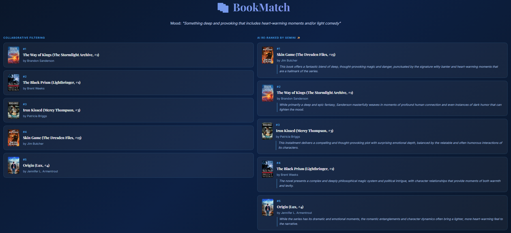

# BookMatch — Collaborative-Filtering Book Recommender with LLM Re-Ranking

A Goodreads book recommender that pairs a collaborative-filtering engine with a
Gemini re-ranking layer, plus a separate prompt-engineering study measuring whether
structured re-ranking prompts actually improve output quality.

Georgetown MSBA · AI Modeling in Practice · Team project with Jaci Goode and Stephanie Ong.
**My contribution:** exploratory data analysis and co-development of the Streamlit application.



## What it does

1. **Collaborative filtering** generates each user's top candidates from the Goodreads
   dataset (9,964 books · 164,728 ratings · 1,192 users · 98.5% sparse).
2. **LLM re-ranking** (Gemini 2.5 Flash Lite) reorders those candidates against a stated
   preference and writes an explanation for each pick. The system prompt constrains the
   model to the candidate list; the UI flags any returned title that doesn't match.
3. **Streamlit app** shows CF and AI-personalized results side by side.
4. **Prompt evaluation** tests baseline vs. structured re-ranking prompts across 20 cases,
   scored on two rubrics by an LLM judge in Braintrust.

## Model selection

| Model (CF) | RMSE | Precision@10 | Recall@10 |
|---|---|---|---|
| Baseline (mean) | 0.842 | 0.657 | 0.791 |
| **UBCF · Pearson · k=50** ✅ | 1.027 | **0.660** | **0.794** |
| UBCF · Cosine · k=10 | 1.020 | 0.649 | 0.780 |
| IBCF · Cosine · k=50 | 0.863 | 0.637 | 0.768 |

UBCF was selected despite the worst RMSE. The task is top-N ranking, not rating
prediction — Precision@10 and Recall@10 are the metrics that matter, and UBCF leads both.
The unusually dense rating matrix (median 129 ratings per user, no cold-start) is why the
mean baseline is hard to beat on RMSE.

## Evaluation finding

A structured prompt (explicit criteria, reasoning steps, fixed output format) lifted
**Explanation Quality from 0.55 → 0.88** but moved **Ranking Fit only 0.35 → 0.43**.

The gap is the interesting part: better prompts produce specific, grounded explanations,
but they can't recommend a good book that CF never retrieved. Ranking quality is capped
upstream. One trace showed the model writing excellent explanations (1.0) for a
candidate pool containing no books matching the request (0.0) — a production trust risk,
since a convincing explanation for a bad recommendation is worse than a vague one.

Note: the evaluation ran both prompts and both judge rubrics on Claude Sonnet 4.6, not
on the Gemini model the app ships with. It measures prompt design, not the deployed layer.

## Tech stack

Python · Surprise (CF library) · pandas · scikit-learn · Gemini API · Streamlit · Braintrust

## Running it locally

```bash
git clone https://github.com/mdrew300/data-analytics-portfolio.git
cd data-analytics-portfolio/ai-recommender-goodreads
pip install -r requirements.txt

# Gemini API key required for the re-ranking layer
# add to .streamlit/secrets.toml as: GEMINI_API_KEY = "your-key"

streamlit run goodreads_app.py
```

## Data

Goodreads books and ratings dataset (`Books.csv`, `Ratings.csv`), included in this folder.
[ADD SOURCE — Kaggle link or wherever the course provided it]

## Limitations

- CF retrieval sets a ceiling on ranking quality; the re-ranker can't surface a book
  outside the candidate pool.
- Only title and author are passed to the model, so explanations lean on its own prior
  knowledge of well-known titles rather than on supplied metadata.
- Evaluation is 20 cases, single run, with the same model family generating and judging.
- Candidate quality confounds the Ranking Fit score — poor retrieval reads as poor prompting.
